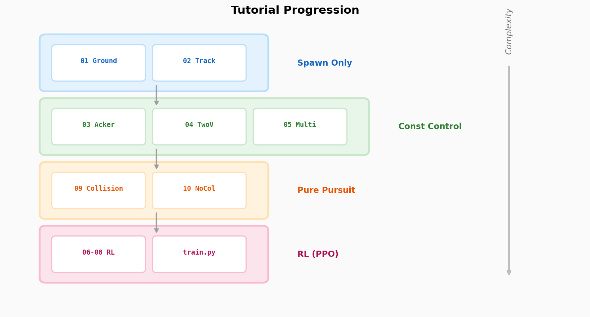
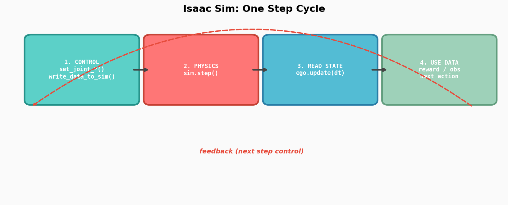
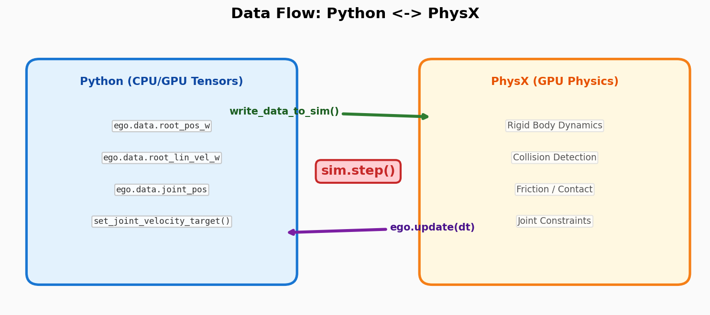
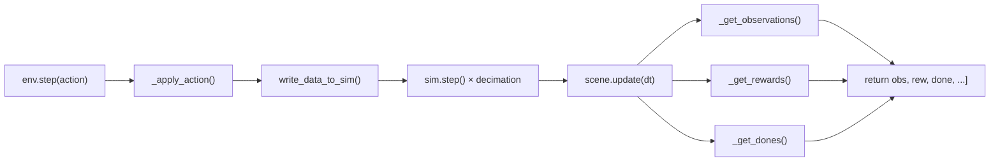

# Itutorial Guide

HMCLab_Isaac의 Isaac Sim / Isaac Lab 튜토리얼 코드 해설.

---

## 튜토리얼 진행 순서



| Level | Tutorials | for문 안 제어 방식 |
|:---:|---|---|
| **Spawn Only** | `01_ground`, `02_track` | 제어 없음 → 차량 정지 |
| **Const Control** | `03_ackermann`, `04_two`, `05_multi` | 상수 `(steer, speed)` |
| **Pure Pursuit** | `09_collision`, `10_multi_env` | 센터라인 자동 추종 |
| **RL (PPO)** | `06~08_rl_*`, `rl/train.py` | 학습된 정책 네트워크 |

---

## 핵심 개념: Simulation Loop

> **`sim.step()` 전에 어떤 값을 넣느냐가 전부.**
> 상수 → 원호, PID → 경로추종, pure pursuit → 센터라인 추종, RL → 학습된 정책.



### 한 step의 4단계

```python
for i in range(steps):
    # ① CONTROL — 이번 step에 "뭘 할지" 결정
    apply_ackermann(ego, spec, steer=0.1, speed=3.0)
    ego.write_data_to_sim()       # Python → PhysX 전달

    # ② PHYSICS — GPU에서 물리 계산 (힘, 충돌, 마찰)
    sim.step()

    # ③ READ — 결과를 Python 텐서로 가져옴
    ego.update(dt)

    # ④ USE — 읽은 데이터로 판단/기록
    pos  = ego.data.root_pos_w       # 위치
    vel  = ego.data.root_lin_vel_w   # 속도
    quat = ego.data.root_quat_w     # 자세 (전복 판정 등)
```

④에서 읽은 결과가 다음 step의 ①에 피드백 → **제어 루프** 완성.

---

## 매 step의 사이클

```
제어 명령 설정  →  물리 시뮬  →  결과 읽기  →  활용
─────────────     ────────     ──────────     ──────
set_joint_*()     sim.step()   ego.update()   ego.data.*
write_data_to_sim()                           ├─ root_pos_w     위치 확인
                                              ├─ root_lin_vel_w  속도 계산
                                              ├─ root_quat_w    방향/자세
                                              └─ joint_pos/vel  조인트 상태
```

4번째 "활용" 단계에서 읽은 데이터로:
- **상수 제어**: 그냥 무시 (다음 step도 같은 입력)
- **Pure pursuit**: 현재 위치·방향으로 다음 스티어링 계산
- **RL**: reward/done 계산 → 정책 업데이트 → 다음 action 출력

즉 **제어 → 물리 → 읽기 → 활용**이 한 사이클이고,
"활용"의 결과가 다음 사이클의 "제어"에 피드백되는 루프.

---

## 데이터 흐름: Python ↔ PhysX



### `sim.step()` vs `ego.update(dt)` — 왜 분리?

| | `sim.step()` | `ego.update(dt)` |
|---|---|---|
| **하는 일** | GPU에서 물리 계산 실행 | GPU → Python 텐서로 상태 복사 |
| **없으면?** | 시간이 안 감 | `ego.data.*`가 이전 값으로 남음 |
| **비용** | 무거움 (물리 연산) | 가벼움 (메모리 복사) |

**분리된 이유:**

1. **Decimation** — 물리를 N번 돌리고 상태는 1번만 읽기 (GPU 효율):
   ```python
   for _ in range(decimation):  # 예: 2번 물리
       sim.step()
   ego.update(dt * decimation)  # 1번만 읽기
   ```

2. **선택적 업데이트** — 로봇이 여러 대일 때 필요한 것만:
   ```python
   sim.step()        # 전체 물리
   ego.update(dt)    # ego만 읽기 (opp는 안 읽어도 됨)
   ```

3. **write도 동일** — `set_joint_*()` 후 `write_data_to_sim()` 필수.
   빼먹으면 입력이 PhysX에 안 전달됨.

---

## 기본 뼈대: 3단계 구조

모든 standalone 튜토리얼(01~05, 09~11)의 `main()` 함수:

```python
def main():
    # ━━━ 1단계: 세계 + 로봇 준비 ━━━
    sim = SimulationContext(SimulationCfg(dt=0.01, device="cuda:0"))
    GroundPlaneCfg().func("/World/ground", ...)     # 바닥
    DomeLightCfg(...).func("/World/Light", ...)      # 조명
    ego = Articulation(ego_cfg)                      # 로봇 스폰
    sim.reset()                                      # ← PLAY

    # ━━━ 2단계: 시뮬레이션 루프 ━━━
    for i in range(steps):
        apply_ackermann(ego, spec, steer, speed)     # 제어
        ego.write_data_to_sim()                      # → PhysX
        sim.step()                                   # 물리 계산
        ego.update(dt)                               # ← Python

    # ━━━ 3단계: 결과 확인 ━━━
    print(ego.data.root_pos_w)
```

---

## 액추에이터 제어 모드

PhysX 조인트 드라이브 공식:

```
torque = stiffness × (pos_target - pos_current)
       + damping   × (vel_target - vel_current)
       + effort_target

실제 적용 = clamp(torque, -effort_limit, +effort_limit)
```

**stiffness와 damping 조합으로 모드가 결정:**

| 모드 | stiffness | damping | API | 용도 |
|---|---|---|---|---|
| **위치 제어** | 높음 (5000+) | 낮음 | `set_joint_position_target()` | 스티어링 각도 |
| **속도 제어** | 0 | 높음 (30+) | `set_joint_velocity_target()` | 바퀴 회전 |
| **토크 제어** | 0 | 0 | `set_joint_effort_target()` | 직접 토크 입력 |

```python
# 위치 제어 (스티어링) — stiffness가 각도를 잡아줌
"steering": ImplicitActuatorCfg(stiffness=8000, damping=200)
ego.set_joint_position_target(steer_angle)

# 속도 제어 (바퀴) — damping이 속도를 유지시킴
"drive": ImplicitActuatorCfg(stiffness=0, damping=30)
ego.set_joint_velocity_target(wheel_speed)

# 토크 제어 — PD 없이 직접 Nm 지정
"drive": ImplicitActuatorCfg(stiffness=0, damping=0)
ego.set_joint_effort_target(torque_nm)
```

내부적으로 PhysX는 항상 **토크**로 동작. 위치/속도 제어는 PD 컨트롤러가
자동으로 토크를 계산해주는 것이고, 토크 제어는 PD를 끄고 직접 넣는 것.

---

## 실제 모터 파라미터 매핑

실제 차량의 모터 스펙 (KV, 기어비, VESC 파라미터)을 시뮬에 반영하는 방법.

### 핵심 변환 공식

```python
KV = 3200           # RPM/V (모터 KV)
I_max = 40          # A (VESC 최대 전류)
V_battery = 22.2    # V (6S LiPo)
gear_ratio = 5.0    # 모터:바퀴 기어비
wheel_radius = 0.055

Kt = 60 / (2 * 3.14159 * KV)                # Nm/A (토크 상수)
wheel_torque_max = Kt * I_max * gear_ratio   # Nm (바퀴 최대 토크)
wheel_rpm_max = KV * V_battery / gear_ratio
max_speed = wheel_rpm_max * 2 * 3.14159 / 60 * wheel_radius  # m/s
```

### VESC FOC 파라미터 → Isaac Sim

| VESC 파라미터 | Isaac Sim 매핑 |
|---|---|
| `flux_linkage` (λ) | `Kt = 1.5 × λ` |
| `l_current_max` | `effort_limit = Kt × I_max × gear_ratio` |
| `motor_resistance` (R) | damping 계산에 사용 |
| `max_erpm` | `velocity_limit = max_erpm / (pole_pairs × gear_ratio) × 2π/60` |

### Isaac Lab DCMotor 액추에이터

```python
from isaaclab.actuators import DCMotorCfg

"drive": DCMotorCfg(
    effort_limit=wheel_torque_max,
    velocity_limit=wheel_rad_s_max,
    saturation_effort=wheel_torque_max,
    # DC모터 특성: torque = T_max × (1 - speed/speed_max)
)
```

---

## 질량 설정

Isaac Sim (PhysX)에서 질량을 결정하는 2가지 방법:

| 방법 | 설정 | 우선순위 |
|---|---|---|
| **직접 지정** | `MassAPI.mass = 2.5` (kg) | **높음** (density 무시) |
| **밀도 × 부피** | `density × collision_volume` | mass 없을 때만 사용 |

```python
# 코드에서 직접 질량 지정
UsdPhysics.MassAPI.Apply(prim)
mass_api.CreateMassAttr().Set(2.5)  # kg
```

GUI에서: prim 선택 → Properties → `Physics > Mass` 에 숫자 입력.

> **실차 무게를 알고 있으면 mass를 직접 넣는 것이 가장 정확.**
> density 자동 계산은 기본값 1000 kg/m³ (물)이라 비현실적일 수 있음.

---

## 3D 모델 포맷

```
정밀도 높음                         정보 많음
    │                                  │
 STP/STEP ────── OBJ ────── URDF ────── USD
    │              │           │          │
 CAD 곡면      메쉬+색상    로봇 구조    모든 것
 설계용        시각화용      조인트정의   Isaac Sim용
```

| 포맷 | 확장자 | 형상 | 색상 | Isaac Sim |
|---|---|---|---|---|
| **STP/STEP** | `.stp` `.step` | CAD 곡면 (NURBS) | 파트별 | **pip 설치: import 불가** |
| **STL** | `.stl` | 삼각 메쉬 | **없음** | import 가능 |
| **OBJ** | `.obj` + `.mtl` | 삼각 메쉬 | MTL에 정의 | **import 가능** (추천) |
| **USD** | `.usd` `.usda` | 모든 것 | 포함 | **네이티브** |

### MTL 파일이란

OBJ의 색상/재질 동반 파일:

```
mid360.obj  → "mtllib mid360.mtl" (OBJ 안에 이 한 줄)
                    ↓
mid360.mtl  → "Kd 0.12 0.12 0.14" (색상 RGB)
               "Ks 0.3 0.3 0.3"   (반사광)
               "Ns 50"             (광택도)
```

- MTL 있으면 → 파트별 색상 적용
- MTL 없으면 → 전부 회색
- Isaac Sim GUI에서 직접 material 설정할 거면 MTL 없어도 됨

### STP vs OBJ 핵심 차이

```
STEP:  원 = "중심(0,0), 반지름 5"  ← 수식 하나 (무한 정밀)
OBJ:   원 = 64개 삼각형 좌표 목록    ← 수백 줄 (근사)
```

변환 시 곡면 → 삼각형으로 tessellate됨. **STEP은 원본으로 보관, OBJ는 시뮬용.**

### STP/STEP → Isaac Sim 워크플로우

```
STP (원본 CAD)
 ↓  온라인 변환 (imagetostl.com)
OBJ + MTL (색상 보존)
 ↓  Isaac Sim GUI > File > Import
USD (최종 시뮬레이션용)
```

- STP → OBJ: https://imagetostl.com/convert/file/stp/to/obj#convert
- `.stp` = `.step` 동일 포맷. 확장자만 다름 (`cp a.stp a.step`으로 충분)

> **⚠️ pip install Isaac Sim에서는 STEP 직접 import 불가.**
> 내부적으로 `kit/kit` 바이너리를 호출하는데 pip에 미포함.
> **OBJ로 변환 후 import하면 pip에서도 정상 작동.**

---

## 로봇 코드명 규칙

```
UR26-01
││  │└─ 일련번호 (01, 02, 03, ...)
││  └── 연도 (25=2025, 26=2026)
│└───── Unicorn Racing
```

기존 로봇은 `HMC_*` 유지. 신규 차량만 `UR__-__` 포맷.

로봇 스펙은 YAML로 관리: `Itutorial/robots/<CODENAME>.yaml`

```yaml
codename: UR26-01
description: "Unicorn Racing 2026 1/8 buggy"
vehicle:
  module: hmclab_isaac.robots.racing.ur26_01
  cfg: UR26_01_CFG
  wheelbase: 0.325
  wheel_radius: 0.055
  max_steer: 0.52
control:
  steer_regex: "wheel_steer$"
  drive_regex: "wheel_throttle$"
```

```python
from robots import load_robot, available_robots
print(available_robots())       # ['HMC_F1TENTH_01', 'HMC_MUSHR_01', ...]
spec = load_robot("UR26-01")    # 정확한 코드명만 허용
spec = load_robot("f1tenth")    # KeyError!
```

---

## 센서 에셋 관리

```
hmclab_isaac/robots/_sensors/
├── mid360/
│   ├── assets/
│   │   ├── mid-360-asm.stp      # 원본 CAD (보관용)
│   │   ├── mid360.obj + .mtl    # imagetostl.com 변환 (색상 보존)
│   │   └── mid360.usd           # GUI에서 import→save한 최종본
│   ├── convert_stp.py           # STP → OBJ 자동 변환 도구
│   └── __init__.py              # attach_mid360_visual()
│
└── nuc/
    ├── NUC14PRO_slim.stp        # 원본 CAD
    ├── NUC14PRO_slim.obj + .mtl # imagetostl.com 변환 (34색 보존)
    └── (nuc14pro.usd)           # GUI에서 save할 최종본
```

**센서 장착 코드:**

```python
from hmclab_isaac.robots._sensors.mid360 import attach_mid360_visual
attach_mid360_visual("/World/Ego", mount_link="base_link", offset=(0.05, 0.0, 0.12))
```

Camera prim과 마찬가지로, 센서 비주얼은 **mesh만 있고 물리(collision/rigid body)는 없는
보이지만 충돌하지 않는 장식**. LiDAR 물리(raycasting)는 별도 `MultiMeshRayCaster`가 처리.

---

## DirectRLEnv (tut06~08, RL)

RL 환경에서는 `env.step(action)` **한 번**이 위 전체를 내부 처리:



직접 `sim.step()` / `ego.update()`를 호출할 필요 없음.

---

## 루프 방식

```python
# 유한 루프 — 정해진 step 수만 실행 후 종료
for i in range(steps):
    sim.step()

# 무한 루프 — GUI 창 닫을 때까지 계속 실행
while simulation_app.is_running():
    sim.step()
    ego.update(dt)
```

---

## 캡처 방식

Isaac Sim 내장 녹화가 아닌, **코드로 가상 카메라를 씬에 배치**하는 방식:

```python
# 씬에 Camera prim 생성 (mesh 없음, 물리 없음, 관측만 하는 유령)
cam = Camera(CameraCfg(prim_path="/World/TopDownCam", ...))

# 매 step: GPU에서 렌더링된 RGB 텐서를 읽음
rgb = cam.data.output["rgb"]   # (1, H, W, 3) 텐서
frames.append(rgb.cpu().numpy())

# 종료 후: imageio로 MP4 저장
imageio.mimsave("output.mp4", frames, fps=30)
```

| Recorder | 동작 |
|---|---|
| `TopDownRecorder` | 고정 위치 (하늘에서 아래로) |
| `ChaseCamRecorder` | 매 step 차량 뒤를 추적 (`set_world_poses_from_view`) |

Camera prim은 **렌더링 전용** — mesh 없음, collision 없음, rigid body 없음.
GUI 뷰포트와는 별개.

---

## 파일 구조 — 3개 카테고리

```
Itutorial/
├── TUTORIAL_GUIDE.md           # ← 이 파일
├── _common.py                  # 공통 (RobotSpec, apply_ackermann, pure_pursuit)
├── figures/                    # 다이어그램 PNG
│
├── robots/                     # 로봇 코드명 레지스트리 (YAML)
│   ├── __init__.py             #   load_robot(codename) → RobotSpec
│   ├── HMC_F1TENTH_01.yaml
│   ├── HMC_MUSHR_01.yaml
│   └── HMC_SRX8_01.yaml
│
├── car/                        # ★ Category A: How to Build a Car
│   ├── 00_list_robots.py       #   등록된 로봇 목록 (Isaac Sim 불필요)
│   ├── 01_inspect_vehicle.py   #   조인트 구조 확인
│   ├── 02_actuator_modes.py    #   위치/속도/토크 제어 비교
│   ├── 03_view_with_sensor.py  #   Mid-360 장착 후 GUI 확인
│   └── 04_view_with_all_sensors.py  # Mid-360 + NUC14 장착
│
├── world/                      # ★ Category B: How to Build a World
│   ├── 01_ground_and_light.py  #   바닥 + 조명 (최소 씬)
│   └── 02_spawn_track.py       #   트랙 로드 + 도로/덕트 스폰
│
├── driving/                    # ★ Category C: Car + World 조합 (주행)
│   └── (기존 01~11 스크립트 참조)
│
├── 01~11_*.py                  # 주행 튜토리얼 (Category C)
│
├── rl/                         # RL 미니 프로젝트
│   ├── s_curve_env.py          #   DirectRLEnv (LiDAR obs)
│   ├── model.py                #   PPO actor-critic MLP
│   ├── train.py                #   학습 루프 (resume 지원)
│   └── eval.py                 #   평가 + 비디오 캡처
│
└── outputs/                    # (gitignored) 스크린샷, MP4
```

---

## 실행 방법

```bash
# conda 환경 활성화
conda activate hmclab_test

# EULA 영구 설정 (한 번만)
echo 'export OMNI_KIT_ACCEPT_EULA=YES' >> ~/.bashrc && source ~/.bashrc

# ── Category A: 차량 ──
python Itutorial/car/00_list_robots.py                        # Isaac Sim 불필요
python Itutorial/car/01_inspect_vehicle.py --robot f1tenth
python Itutorial/car/02_actuator_modes.py --robot mushr
python Itutorial/car/03_view_with_sensor.py --robot f1tenth   # GUI

# ── Category B: 월드 ──
python Itutorial/world/01_ground_and_light.py                 # GUI
python Itutorial/world/02_spawn_track.py --track mini_helix   # GUI

# ── Category C: 주행 ──
python Itutorial/01_spawn_on_ground.py --robot f1tenth
python Itutorial/03_ackermann_on_track.py --robot mushr
python Itutorial/09_collision.py --robot f1tenth --track mini_oval_flat

# ── RL ──
python Itutorial/rl/train.py --robot f1tenth --num_envs 256 --iters 3000 --ckpt ckpt.pt
python Itutorial/rl/eval.py --ckpt ckpt.pt --eval_steps 1000

# ── Isaac Sim Kit 단독 실행 (GUI) ──
isaacsim
# 또는
python -c "from isaaclab.app import AppLauncher; AppLauncher(headless=False).app"
```

> **`args.headless = True`가 코드에 하드코딩**되어 있어서 GUI가 안 뜨는 경우,
> 해당 줄을 `False`로 바꾸거나 `while simulation_app.is_running()` 루프 사용.
