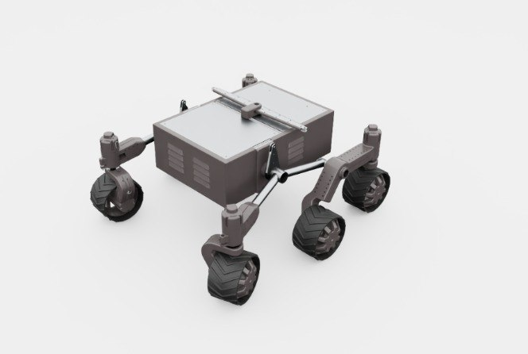

# aau_rover

Aalborg University의 Mars Rover 모델. 풀 rocker-bogie 서스펜션 + 6륜 독립 구동 + 4륜 코너 조향의 리얼리스틱 Mars 로버 기하학.

## 미리보기



## 외형 식별

| 구성 | 설명 |
|---|---|
| **바디** | 회색 직사각형 박스 (벤트 슬릿 있음, 전자장비/배터리 탑재 상정) |
| **지붕 패널** | 흰색 상판 (태양전지 자리) |
| **휠** | 6개 큰 노비 오프로드 타이어 |
| **서스펜션** | 가시적인 rocker-bogie 링크 — 양옆 rocker arm 4개 + 중앙 differential |
| **조향** | 전/후 코너 4륜만 (중앙 2륜은 고정) |

## 조인트 구조 (실측)

```
joints (15):
  # Drive (6 wheels all driven)
  FR_Drive_Continuous   FL_Drive_Continuous
  RR_Drive_Continuous   RL_Drive_Continuous
  CR_Drive_Continuous   CL_Drive_Continuous

  # Steer (corner 4 wheels only — middle pair fixed)
  FR_Steer_Revolute     FL_Steer_Revolute
  RR_Steer_Revolute     RL_Steer_Revolute

  # Rocker-bogie suspension
  FR_Rocker_Revolute    FL_Rocker_Revolute
  RR_Rocker_Revolute    RL_Rocker_Revolute
  Differential_Revolute

total bodies: 16
```

## 센서 구성

**USD 내장 센서 없음** — 섀시/동역학만 모델링된 bare chassis. 센서가 필요하면 env 코드에서:
- `RayCasterCfg` / `MultiMeshRayCasterCfg` 로 LiDAR 어떤 link에 attach
- `TiledCameraCfg` 로 카메라 link 추가
- IMU는 base_link 상태에서 계산

즉 RLRoverLab는 차량과 센서를 분리해서 다루는 설계. 센서 포함된 메시 USD가 필요하면 `exomy`나 `mushr_nano_v2` 같은 built-in sensor 모델 권장.

## ExoMy 와 비교

| 항목 | `aau_rover` | `exomy` |
|---|---|---|
| 바디 수 | 16 | 19 |
| 조인트 수 | 15 | 15 |
| Drive | 6 | 6 |
| Steer | **4** (코너만) | **6** (전륜) |
| Rocker/Bogie | **5** (4 rocker + 1 diff) | **3** (bogie) |
| 서스펜션 모델 | 전통적 rocker-bogie (NASA 스타일) | 단순화 bogie |
| 외형 | 직사각형 박스, 오프로드 타이어 | 컴팩트 ExoMars 스타일 |
| 용도 | 험지 네비게이션 RL, 물리 정확도 높음 | 학습 파이프 프로토타이핑 |

## 포팅 상태

**현재**: 미리보기만.

## USD 위치

```
hmclab_isaac/robots/others/aau_rover/assets/
├── Mars_Rover.usd                       (메인, 총 34 MB)
├── Mars_Rover_Instanceable.usd
├── Mars_Rover_Instanceable_meshes.usd
└── SubUSDs/                              (재질, 메시 서브 파일)
```

**원본**: `reference_repos/RLRoverLab/rover_envs/assets/robots/aau_rover/`

`Mars_Rover_Instanceable.usd` 는 여러 인스턴스를 효율적으로 스폰하기 위한 변종. RL 학습(병렬 env 많을 때)엔 `Instanceable` 버전이 더 빠름.
