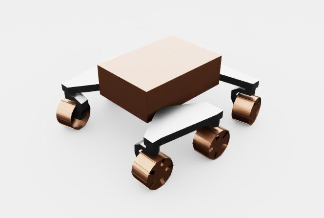

# aau_rover_simple

Aalborg University AAU Rover의 **간소화(simple) 변종**. Full `aau_rover`와 기하학적 구성은 비슷하나 메시 해상도와 rocker-bogie 복잡도를 낮춘 경량 모델.

## 미리보기



> 갈색 블록 바디 + 흰색 bogie 암 + 동색 실린더 휠 — 스타일라이즈된 로-폴리 룩.

## 외형 식별

| 구성 | 설명 |
|---|---|
| **바디** | 갈색(tan) 사각 블록 — 디테일 없음, 단순 쉘 |
| **Bogie arm** | 흰색 길쭉한 L자 링크 × 3 |
| **휠** | 6개 동색(copper) 원통 — 디테일한 트레드 없음, 단순 실린더 |
| **서스펜션** | 3 bogie joint (full은 4 rocker + 1 differential) |

## 조인트 구조 (실측)

```
joints (13):
  # Drive (6)
  FL_Drive_Continuous   FR_Drive_Continuous
  CL_Drive_Continuous   CR_Drive_Continuous
  RL_Drive_Continuous   RR_Drive_Continuous

  # Steer (4 corners only)
  FL_Steer_Revolute     FR_Steer_Revolute
  RL_Steer_Revolute     RR_Steer_Revolute

  # Bogie (3 — simplified)
  FL_Boogie_Revolute    FR_Boogie_Revolute
  R_Boogie_Revolute     ← 뒤는 L/R 합친 단일 joint

total bodies: 14
```

> 참고: 원본 USD에 "Boogie" 오타 그대로. joint regex로 매칭할 때 유의.

## 센서 구성

**USD 내장 센서 없음**. `aau_rover`와 같이 섀시 전용. 센서 장착은 env 코드에서 처리.

## Full vs Simple 비교

| 항목 | `aau_rover` (full) | `aau_rover_simple` |
|---|---|---|
| Bodies | 16 | **14** |
| 조인트 | 15 | **13** |
| Rocker/Bogie | 4 rocker + 1 diff | 3 bogie |
| 메시 품질 | 고해상도 (디테일 vent, 태양전지) | 로-폴리 블록 |
| 렌더 부담 | 높음 | 낮음 |
| 용도 | 영상/데모, 현실성 연구 | 빠른 RL 프로토타입, 다중 env 학습 |

**언제 어느 걸 쓸까:**
- 수백 envs 병렬 RL → `aau_rover_simple` (메모리/렌더 부담 적음)
- 평가/데모 영상, 센서 시뮬 현실성 → `aau_rover` (full)

## 포팅 상태

**현재**: 미리보기만.

## USD 위치

```
hmclab_isaac/robots/others/aau_rover_simple/assets/
├── rover_instance.usd                   (메인)
├── props/                                (서브 에셋)
└── localhost/                            (RLRoverLab이 참조 해결용으로 쓰던 디렉토리)
```

**원본**: `reference_repos/RLRoverLab/rover_envs/assets/robots/aau_rover_simple/`
