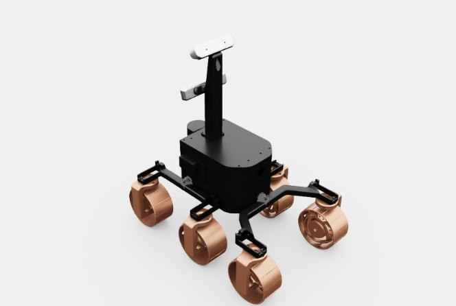

# exomy

ExoMy: ESA ExoMars 기반 6륜 스몰스케일 로버. **현재 full port 완료** (`exomy_cfg.py` + envs/offroad 에서 사용 중).

## 미리보기



> 검정 원형 바디 + 상단 마스트에 스테레오 카메라 + 6 동색 노비 휠. 각 휠마다 보이는 조향 포스트 + 중앙 bogie 링크.

## 외형 식별

| 구성 | 설명 |
|---|---|
| **바디** | 검정 둥근 사각 enclosure (전자장비 케이스) |
| **마스트** | 위로 솟은 포스트 + 상단 스테레오 카메라 모듈 2개 |
| **휠** | 6 × 동색(copper) 노비 타이어 (각 휠에 보이는 조향 포스트) |
| **서스펜션** | 가시적 rocker-bogie 링크 (bogie 3개) |
| **조향** | 6륜 전부 독립 (spot-turn, crab-walk 가능) |

## 구성

```
exomy/
├── exomy_cfg.py           # ArticulationCfg + 상수
├── __init__.py
├── preview.jpg            # 갤러리 이미지
└── assets/
    ├── exomy.usd          # 섀시 (19MB)
    └── SubUSDs/
        ├── materials/
        └── textures/
```

## 센서 구성 (USD 실측)

상단 마스트에 **카메라 2종** 마운트 프레임 포함:

| 센서 | 마운트 | USD prim |
|---|---|---|
| **스테레오/RGBD 카메라** (`a_D_Cam`) | `/Exomy/Mast/a_D_Cam_Joint` | fixed joint frame |
| **Tracking 카메라** (visual odometry용) | `/Exomy/Mast/Tracking_Cam_Joint` | fixed joint frame |
| **LiDAR** | ❌ | — |
| **IMU** | ❌ | — |

마스트 자체가 `/Exomy/Mast` xform에 visual+collision mesh로 존재. 두 카메라 프레임은 fixed joint만 있고 실제 Camera prim은 없음 → env에서 `TiledCameraCfg`를 해당 프레임에 attach 필요.

추가로 필요하면 `_sensors/lidar.py` 팩토리로 base_link에 LiDAR 달고, IMU는 base_link rigid body state에서 유도.

## 조인트 구조 (실측)

| 타입 | 이름 regex | 개수 | 제어 |
|---|---|---|---|
| Steer | `.*Steer_Joint` | **6** (CL/CR/FL/FR/RL/RR) | position (stiffness=8000) |
| Drive | `.*Drive_Joint` | **6** (CL/CR/FL/FR/RL/RR) | velocity (damping=4000) |
| Bogie | `.*Bogie_Joint` | **3** (Left/Right/Rear) | passive |

6륜 **전부** 독립 조향 + 독립 구동 가능. skid-steer, crab-walk, spot-turn 등 다양한 움직임을 구현할 수 있음. bogie는 지면 굴곡 흡수용 passive pivot.

총 body 수: 19, 총 joint 수: 15.

## 제원 (대략, URDF 확인 필요)

| 항목 | 값 |
|---|---|
| 휠베이스 | 0.30 m |
| 트랙 폭 | 0.25 m |
| 바퀴 반경 | 0.08 m |
| 최대 조향 | ±1.05 rad (~60°) |

## 사용 예

```python
from hmclab_isaac.robots.others.exomy import EXOMY_CFG

cfg = EXOMY_CFG.replace(prim_path="/World/envs/env_.*/Rover")
```

`AppLauncher` 부팅 후에만 import 가능 (isaaclab.sim 의존).

## 원본

[RLRoverLab](https://github.com/abmoRobotics/RLRoverLab) `rover_envs/assets/robots/exomy/`.
원본은 `RoverArticulation` 커스텀 서브클래스를 쓰지만, 여기선 stock `isaaclab.assets.Articulation`으로 충분.
