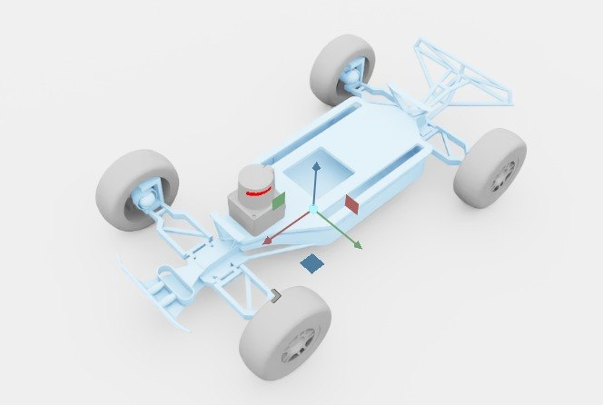

# f1tenth_wl

UW Robot Learning Lab의 F1TENTH 빌드 — Traxxas 1/10 스케일 섀시 기반 오픈 프레임 RC 레이싱 카.

## 미리보기



> Isaac Sim 뷰포트 스크린샷. 기본 원점 스폰 상태.

## 외형 식별

스크린샷에서 보이는 것:

| 구성 | 설명 |
|---|---|
| **섀시** | Traxxas 1/10 4×4 플랫폼 (Slash 계열로 추정). 고무 노비 타이어 + 멀티스포크 휠 |
| **프레임** | 3D 프린트 또는 알루미늄 스페이스프레임 — 센서/컴퓨트 플레이트 장착용 |
| **서보** | 중앙 하단의 빨간 원통 = 조향 서보 |
| **앞쪽 브래킷** | 전방의 수직 프레임 = Hokuyo / LiDAR 마운트 플레이트 자리 |
| **서스펜션** | 4륜 독립 위시본 + 댐퍼 (일반 Traxxas 구성) |

실제 WheeledLab 프로젝트는 이 섀시를 F1TENTH 경주 규격 하드웨어에 맞춰 개조한 버전이에요. [UW Robot Learning](https://uwrobotlearning.github.io/WheeledLab/) 프로젝트 결과물.

## 센서 구성 (USD 실측)

| 센서 | 마운트 | USD prim |
|---|---|---|
| **2D LiDAR (Hokuyo)** | `/f1tenth/hokuyo_1` 마운트 (base_link에 fixed joint) | `/f1tenth/hokuyo_1/Lidar` |
| **카메라** | ❌ 없음 | — |
| **IMU** | ❌ 없음 | — |

**놀라운 점**: USD에 **ROS2 OmniGraph가 이미 내장**돼 있어요:
```
/f1tenth/ROS_LiDAR/
├── on_playback_tick
├── isaac_read_simulation_time
├── isaac_read_lidar_beams_node
└── ros2_publish_laser_scan    ← /scan 토픽으로 퍼블리시
/f1tenth/ROS_Odom/...
```

M7 ROS2 통합 다시 시도할 때 이 패턴을 참고하거나 그대로 쓸 수 있음. 다만 우리 conda/Jazzy 환경 이슈는 그대로 — USD 안의 노드가 있어도 rclpy 자체가 안 뜨면 토픽 발행 불가.

## 우리 f1tenth_mid360 과의 차이

| 항목 | `f1tenth_mid360` (우리) | `f1tenth_wl` (WheeledLab) |
|---|---|---|
| USD 크기 | 32 KB | 41 MB |
| 지오메트리 | Cube + Cylinder primitive (URDF 변환 시 단순화됨) | 실제 삼각형 메시 |
| Visual fidelity | 매우 단순 (블록형) | 고해상도 (데모/영상에 적합) |
| 조인트 | 6 (2 steer + 4 wheel) | 6 (2 rotator + 4 wheel) |
| 뒷바퀴 조향 | ❌ | ❌ |
| 앞바퀴 조향 | ✅ (front_*_steering) | ✅ (rotator_*) |
| 센서 마운트 프레임 | `lidar_link`, `camera_link` 내장 | 없음 (섀시만, 센서는 외부에서 attach 필요) |

## 스폰 검증

```bash
# 원점에 섀시 1대만 띄워서 GUI 확인 (headless=False)
python /tmp/gui_wl_f1tenth.py
```

- 조인트 리스트: `wheel_back_left`, `wheel_back_right`, `wheel_front_left`, `wheel_front_right`, `rotator_left`, `rotator_right`
- Total bodies: 8
- Unresolved reference 경고: **0** (깨끗한 USD 컴포지션)

## 포팅 상태

**현재**: 미리보기 (USD 파일 경로만 알림, 정식 cfg 아직 없음)

**계획** (필요 시):
1. `assets/f1tenth_wl.usd` — WheeledLab 원본 USD 복사
2. `f1tenth_wl_cfg.py` — `ArticulationCfg` + actuator 정의 (WheeledLab의 `F1TENTH_CFG` 변형)
3. `sensors.py` — Hokuyo 2D LiDAR 마운트 (실제 racing 대회 사양)
4. 기존 `envs/racing/*` 와 호환되도록 prim_path / 조인트 이름 매핑

## USD 위치

```
hmclab_isaac/robots/racing/f1tenth_wl/assets/f1tenth.usd   (41 MB, 로컬 사본)
```

**원본**: `reference_repos/WheeledLab/source/wheeledlab_assets/data/Robots/F1TENTH/f1tenth.usd`
