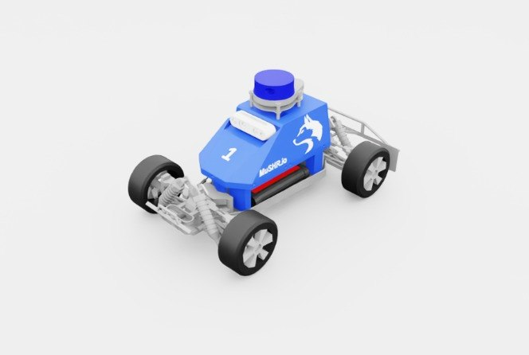

# mushr_nano

UW **MuSHR.io** Nano **v1** 빌드. v2의 전신 — 같은 스타일의 바디 쉘/LiDAR 돔이지만 articulation이 더 단순해요.

## 미리보기



## 조인트 구조 (실측)

```
joints (6):
  back_left_wheel_throttle     back_right_wheel_throttle
  front_left_wheel_throttle    front_right_wheel_throttle
  front_left_wheel_steer       front_right_wheel_steer
total bodies: 13
```

4 throttle + 2 steer. v2와 달리 **suspension joint가 articulation에 포함되지 않음** — rigid body 연결만 있음. 단순한 만큼 학습 속도는 빠름.

## v1 vs v2 비교

| 항목 | `mushr_nano` (v1) | `mushr_nano_v2` |
|---|---|---|
| 출처 | UWPRL | UWRLL |
| 조인트 수 | 6 | 10 |
| Body 수 | 13 | 17 |
| 서스펜션 | ❌ (고정 링크) | ✅ (4륜 독립 passive joint) |
| 물리 현실성 | 낮음 | 높음 |
| 학습 속도 | 빠름 | 살짝 느림 |
| 외형 (visual) | 동일 | 동일 |

두 USD는 외형이 거의 같고, 차이는 "얼마나 세밀한 물리를 원하는가"에 있음. 간단한 RL 베이스라인 실험엔 v1, 센서/서스펜션 현실성 필요 시 v2.

## 센서 구성 (USD 실측)

v2와 동일:

| 센서 | 마운트 | USD prim |
|---|---|---|
| **2D LiDAR** | `/mushr_nano/laser_link` | `/mushr_nano/laser_link/Lidar` |
| **RGB 카메라** | `/mushr_nano/camera_link` | visual mesh만 (Camera prim ❌) |
| **IMU** | ❌ | — |

## 용도

v1은 시뮬-실물 동일성을 덜 따지는 RL 초기 실험이나, 빠른 파이프라인 프로토타이핑에 적합.

## 포팅 상태

**현재**: 미리보기만.

## USD 위치

```
hmclab_isaac/robots/racing/mushr_nano/assets/mushr_nano.usd   (29 MB, 로컬 사본)
```

**원본**: `reference_repos/WheeledLab/source/wheeledlab_assets/data/Robots/UWPRL/mushr_nano.usd`
