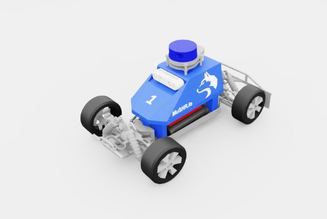

# mushr_nano_v2

UW의 **MuSHR.io** (Multi-agent System for non-Holonomic Racing) Nano **v2** 빌드. 스타일라이즈된 바디 쉘 + LiDAR 돔 + IMU 보드를 통합한 컴팩트 자율주행 레이싱 플랫폼.

## 미리보기



> Isaac Sim 뷰포트 스크린샷. 바디 쉘 "1" 번호, 파란 LiDAR 돔, MuSHR.io 로고 및 늑대 마스코트.

## 외형 식별

| 구성 | 설명 |
|---|---|
| **바디 쉘** | 파란색 플라스틱 유선형 (번호판 "1", MuSHR.io 로고, 늑대 마스코트) |
| **지붕 돔** | 파란 원통형 — 2D LiDAR (Hokuyo UST-10LX 또는 유사) 커버 |
| **상단 브릭** | 하얀 사각 모듈 — 컴퓨트 보드(Jetson Nano) 또는 IMU 박스 |
| **타이어** | 스무스 러버 (레이싱형, 오프로드 노비 아님) |
| **서스펜션** | 4륜 독립 위시본 |

## 조인트 구조 (실측)

```
joints (10):
  back_left_wheel_suspension     back_right_wheel_suspension
  front_left_wheel_suspension    front_right_wheel_suspension
  back_left_wheel_throttle       back_right_wheel_throttle
  front_left_wheel_throttle      front_right_wheel_throttle
  front_left_wheel_steer         front_right_wheel_steer
total bodies: 17
```

4륜 독립 서스펜션(suspension = passive spring joints) + 4륜 구동(throttle) + 2륜 조향(front steer)의 풀 rally 세팅.

## 센서 구성 (USD 실측)

| 센서 | 마운트 | USD prim |
|---|---|---|
| **2D LiDAR** | `/Root/mushr_nano/laser_link` (지붕 돔 위치) | `/Root/mushr_nano/laser_link/Lidar` |
| **RGB 카메라** | `/Root/mushr_nano/camera_link` (바디 전방) | visual/collision mesh만, Camera prim은 없음 |
| **IMU** | ❌ 없음 (상단의 하얀 브릭은 visual only) | — |

USD에 **실제 `Lidar` prim 포함** — Isaac Sim RayCaster가 바로 쏠 수 있음. 카메라는 프레임만 있고 실제 Camera prim은 없어서, env 레벨에서 `TiledCameraCfg`를 프레임에 attach해야 이미지 획득 가능.

## 용도

- **autonomous racing 연구**: 원본 MuSHR은 UW CSE lab에서 MPC, RL, vision-based racing 연구에 사용.
- **스무스 타이어**: 실내 포장 코스(실험실 체육관, F1Tenth 트랙 등)에서 잘 굴러요.
- **대회**: F1TENTH 정식 대회 규격은 아니지만, 비슷한 스케일이라 같은 트랙 활용 가능.

## 포팅 상태

**현재**: 미리보기만 (USD 경로 식별 + 스폰 검증 완료)

**정식 포팅 시 할 일:**
1. USD 복사 → `assets/mushr_nano_v2.usd`
2. `mushr_nano_v2_cfg.py` — ArticulationCfg, actuators (suspension=passive, throttle=velocity, steer=position)
3. LiDAR 마운트 offset 확인 (USD의 LiDAR 돔 xform 위치)
4. 필요 시 sensors.py (Hokuyo 2D 패턴 추가 — 현재 우리 `_sensors/`에 없음, 작은 작업)

## USD 위치

```
hmclab_isaac/robots/racing/mushr_nano_v2/assets/mushr_nano_v2.usd   (29 MB, 로컬 사본)
```

**원본**: `reference_repos/WheeledLab/source/wheeledlab_assets/data/Robots/UWRLL/mushr_nano_v2.usd`

UWRLL = UW Robot Learning Lab. v1은 `UWPRL/mushr_nano.usd` 에 별도 존재 (older build).
