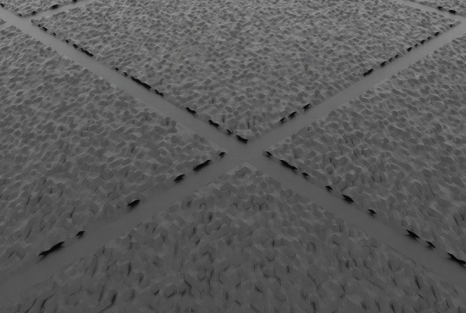

# worlds/offroad/

험지, 경사, 장애물 등 offroad 월드. racing처럼 강한 스키마 계약은 없고, 각 지형 모듈이 `TerrainImporterCfg` 또는 유사 객체를 리턴하는 형태.

## 미리보기



> `rover_rough_terrain_cfg(num_rows=4, num_cols=4, size=(10,10), noise_range=(0.02, 0.08))` 결과. 4×4 = 16개 셀, 각 셀 10×10m에 2~8 cm 랜덤 유니폼 노이즈 적용. 셀 사이 회색 띠는 border (이동 용이성).

## 현재 포함

- `rough_terrain.py` — Isaac Lab `TerrainImporterCfg`를 감싼 헬퍼. `random_rough` sub-terrain 하나만 쓰는 단순 프리셋 (로버 smoke 용).

## 사용 예

```python
from hmclab_isaac.worlds.offroad import rover_rough_terrain_cfg

@configclass
class MyEnvCfg(DirectRLEnvCfg):
    terrain: TerrainImporterCfg = rover_rough_terrain_cfg(
        num_rows=4, num_cols=4, noise_range=(0.02, 0.08),
    )
```

env의 `_setup_scene`에서 `self.cfg.terrain.func(...)`를 호출해 스폰하거나, `InteractiveScene`가 자동 처리.

## 확장 아이디어

- `slopes.py` — 경사로만
- `boulders.py` — 바위/장애물 밀도 랜덤
- `real_dem.py` — 실제 DEM(digital elevation map) heightmap 로더
