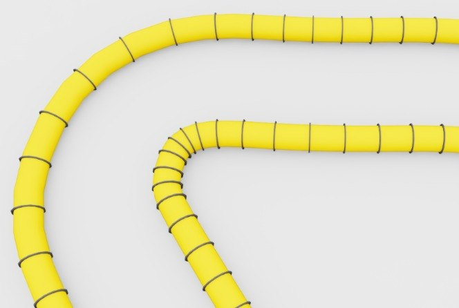

# worlds/racing/

레이싱 트랙. `_schema.py`의 `RacingTrack`이 모든 트랙 표현의 단일 진입점.

## 트랙 데이터 포맷

8컬럼 공백/쉼표 구분 텍스트 (`#` 주석 허용):

```
# x  y  z  roll  pitch  yaw  d_left  d_right
0.00  0.00  0.00  0.00  0.00  0.00  2.50  2.50
0.50  0.00  0.02  0.00  0.03  0.00  2.50  2.50
...
```

의미:
- `(x, y, z)` — 맵 프레임 기준 센터라인 위치
- `(roll, pitch, yaw)` — 해당 점에서 차량 local frame 회전 (ROS REP-103: x=전방, y+=좌측)
- `d_left` — 센터라인 기준 좌측 폭
- `d_right` — 우측 폭

2D 트랙은 `z = roll = pitch = 0`. 3D 트랙(뱅킹, 경사, 루프)은 전 컬럼 활용.

## 사용 예

```python
from hmclab_isaac.worlds.racing import RacingTrack

track = RacingTrack.load("_tracks_data/austin.txt")
pos, rpy = track.spawn_pose(progress=0.0)          # 스폰 pose
left, right = track.boundary_points()              # 벽 mesh용
length = track.length()                            # 리워드용
```

## Mesh 생성기 2종

레이싱 월드는 **같은 `RacingTrack`을 입력**으로 받는 mesh 생성기를 2가지 제공해요. 용도에 맞게 선택:

### 1. `circuit_track.py` — 얇은 벽 스타일

센터라인 좌우 내벽(삼각형 strip) + 바닥. 가볍고 시야 확보가 좋아 디버깅/GUI 데모용.

```python
from hmclab_isaac.worlds.racing import RacingTrack, spawn_circuit
track = RacingTrack.load("hmclab_isaac/worlds/racing/_tracks_data/austin.txt")
spawn_circuit(track, "/World/Track", wall_height=0.5)
```

### 2. `duct_track.py` — 듀얼 파이프 + 리브



굵은 원통 파이프 2개가 센터라인 양옆에 설치 + 일정 간격 리브 링. LiDAR가 잘 인식해서 학습 난이도 조절, real-world racing 대회 분위기 재현, 시각적 볼거리 용도.

```python
from hmclab_isaac.worlds.racing import RacingTrack, spawn_duct_track
track = RacingTrack.load("hmclab_isaac/worlds/racing/_tracks_data/austin.txt")
spawn_duct_track(
    track, "/World/Track",
    pipe_radius=0.2, pipe_offset=1.0,
    rib_spacing=0.5, rib_thickness=0.02, rib_height=0.03,
    duct_color=(1.0, 0.5, 0.0),      # 오렌지
    rib_color=(0.05, 0.05, 0.05),    # 거의 검정
)
```
원본 f1tenth_rl의 `duct_track_builder.py`를 `RacingTrack` 스키마에 맞게 포팅. 출력: 842 ribs × 2 pipes, ~35k duct vertices, ~80k rib vertices (Austin 기준).

## 파일

- `_schema.py` — `RacingTrack` 클래스 + 로더 + 저장 (`save()`)
- `_tracks_data/` — `.txt` 트랙 데이터 (`_tracks_data/README.md` 참고)
- `circuit_track.py` — 얇은 벽 + 노면 mesh (pure-numpy `build_circuit_mesh` + Kit-dep `spawn_circuit`)
- `duct_track.py` — 듀얼 파이프 + 리브 mesh (`build_duct_mesh` + `spawn_duct_track`)
