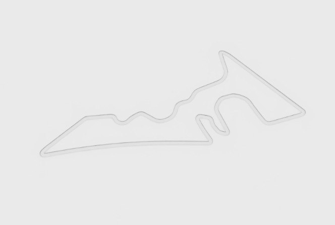
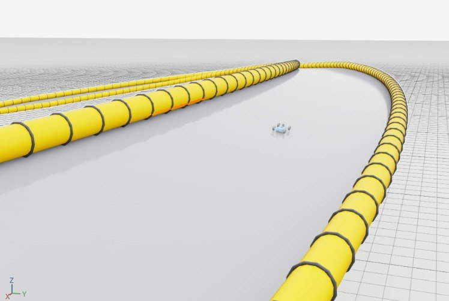

# _tracks_data/

실제 트랙 센터라인 텍스트 파일들. 파일명이 트랙 이름이 돼요.

## 포맷

8컬럼 공백 구분, `#` 주석 헤더. 자세한 건 `../README.md` 참고.

## 현재 포함된 트랙

| 파일 | 원본 | 길이 (m) | 포인트 | 3D | 미리보기 |
|---|---|---|---|---|---|
| `austin.txt` | f1tenth_racetracks Austin (Circuit of the Americas) | ~421 | 1102 | ❌ (평면) | `austin.jpg` |
| `test_oval.txt` | `scripts/generate_test_oval.py` | ~194 | 400 | ✅ (±3m elev, 12° bank) | `test_oval.jpg` |

### austin



> `circuit_track.py`로 생성된 두 경계 strip. 전형적인 COTA 레이아웃: 턴 1 (좌측 가파른 오르막 코너), 중앙의 S자 섹션, 우측의 긴 후반 스트레이트.

### test_oval



> 절차적으로 생성된 타원 테스트 트랙. 직선에서 오르막/내리막 (±3m), 코너에서 뱅킹(12°). 실제 땅 평면(z=0) 위에 3D 트랙이 떠 있고, 그 위에 WheeledLab F1Tenth가 고정 배치. 스키마의 3D 지원(z + rpy)을 end-to-end 검증하는 용도.
>
> ```
> python scripts/generate_test_oval.py --dst ... --a 40 --b 20 --amp-z 3.0 --amp-roll-deg 12.0
> ```

## 새 트랙 추가

```bash
python scripts/convert_f1tenth_track.py \
  --src /path/to/<Track>_centerline.csv \
  --dst hmclab_isaac/worlds/racing/_tracks_data/<lower>.txt \
  --name <lower>
```

2D f1tenth 포맷은 자동으로 yaw 계산해서 8컬럼 스키마로 변환됨. 3D 데이터(뱅킹/경사)는 직접 편집하거나 별도 변환기를 만들어야 합니다.
